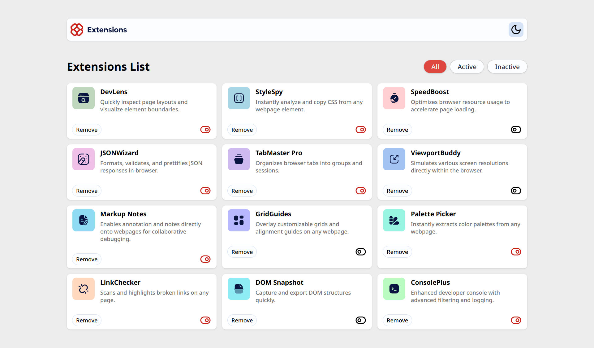

# Frontend Mentor - Browser extensions manager UI solution

This is a solution to the [Browser extensions manager UI challenge on Frontend Mentor](https://www.frontendmentor.io/challenges/browser-extension-manager-ui-yNZnOfsMAp). Frontend Mentor challenges help you improve your coding skills by building realistic projects. 

## Table of contents

- [Overview](#overview)
  - [The challenge](#the-challenge)
  - [Screenshot](#screenshot)
  - [Links](#links)
- [My process](#my-process)
  - [Built with](#built-with)
- [Author](#author)


**Note: Delete this note and update the table of contents based on what sections you keep.**

## Overview

### The challenge

Users should be able to:

- Toggle extensions between active and inactive states
- Filter active and inactive extensions
- View the optimal layout for the interface depending on their device's screen size
- See hover and focus states for all interactive elements on the page

### Screenshot



### Links

- Solution URL: [https://github.com/abok-cymk/browser-extensions-manager-ui-main]
- Live Site URL: [Add live site URL here](https://your-live-site-url.com)

## My process

### Built with

- Semantic HTML5 markup
- CSS custom properties
- Flexbox
- CSS Grid
- Mobile-first workflow
- React(https://reactjs.org/) - JS library


### What I learned
Reusable compnents using props
```
const Tab = ({ tabTitle, onClick, isTabActive }) => {
  return (
    <button
      onClick={onClick}
      className={`
         rounded-full text-sm px-4 py-1 cursor-pointer font-500 shadow outline outline-neutral-300 hover:border-2 hover:border-custom-red-700
        ${
          isTabActive
            ? "bg-custom-red-500 hover:bg-custom-red-700 text-neutral-100 hover:text-neutral-50"
            : "bg-neutral-0 hover:bg-neutral-50 text-neutral-800 hover:text-neutral-600"
        }`}
    >
      {tabTitle}
    </button>
  );
};

export default Tab;
```
## Author

- Frontend Mentor - [@abok-cymk](https://www.frontendmentor.io/profile/abok-cymk)
- Twitter - [@abokallan22](https://x.com/abokallan22)

